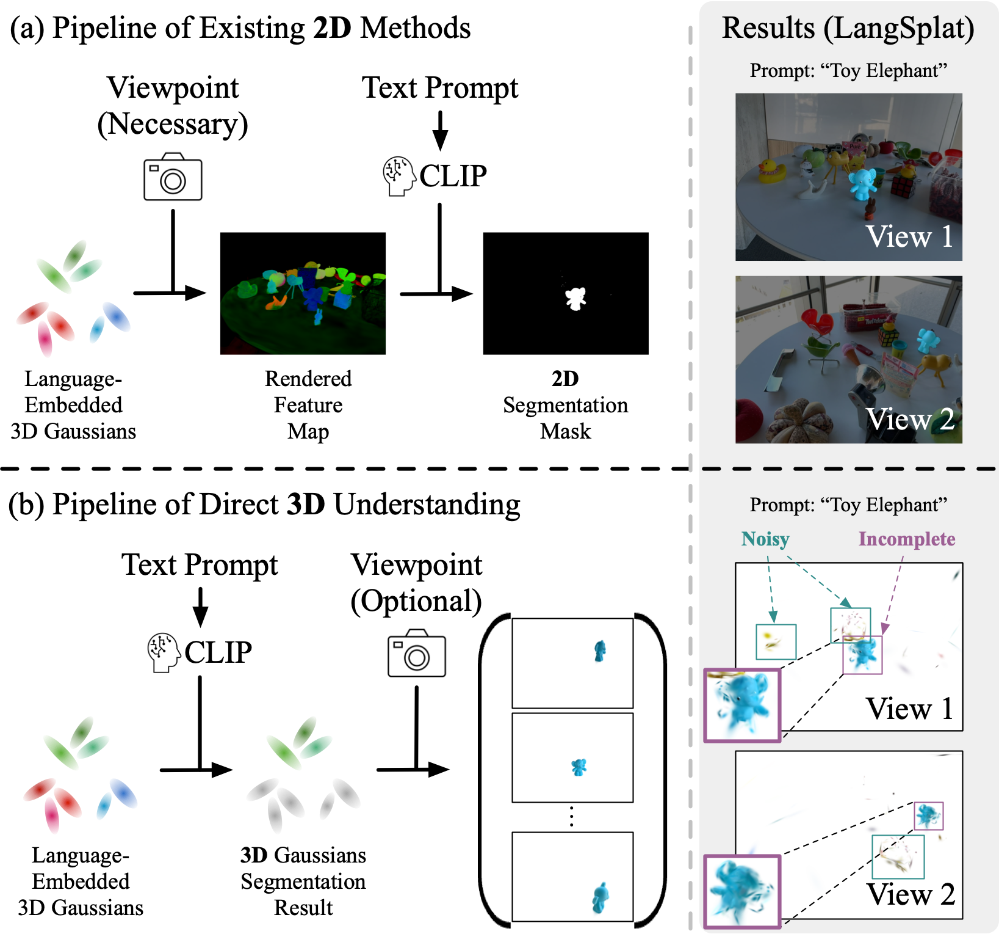
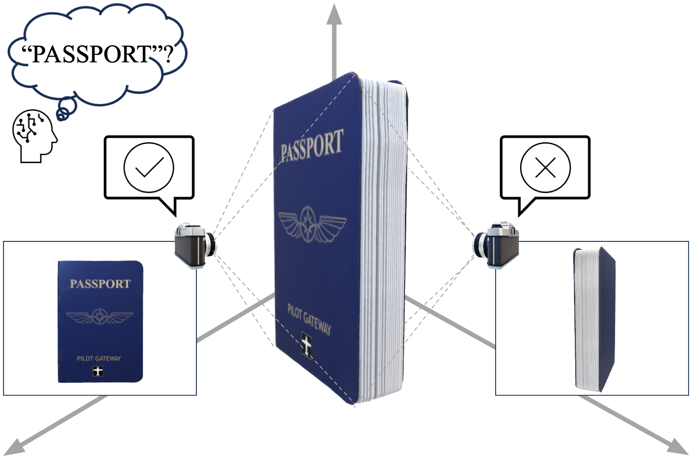
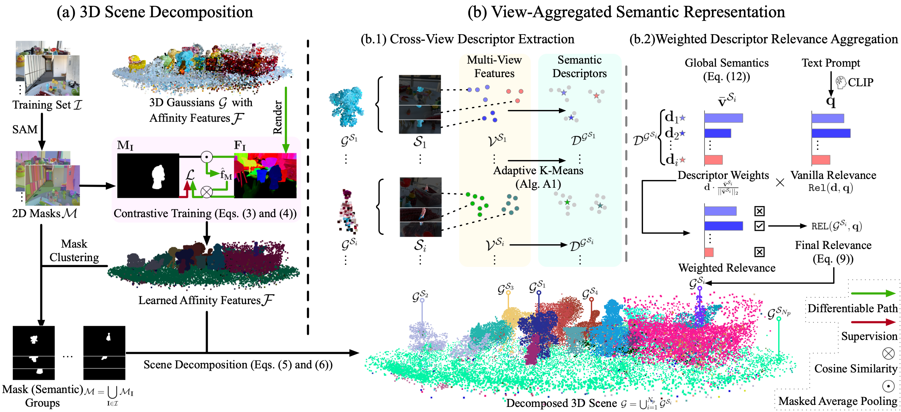

# 3D Language Gaussians (LaGa)
### [Project Page](https://jumpat.github.io/laga-page/) | [Arxiv Paper](https://arxiv.org/abs/2505.24746) 

**Tackling View-Dependent Semantics in 3D Language Gaussian Splatting**

[Jiazhong Cen](https://github.com/Jumpat)<sup>1</sup>, [Xudong Zhou]()<sup>1</sup>, [Jiemin Fang](https://jaminfong.cn/)<sup>2✉</sup>, [Changsong Wen](https://downdric.github.io/?)<sup>1</sup>, [Lingxi Xie](http://lingxixie.com/)<sup>2</sup>, [Xiaopeng Zhang](https://sites.google.com/site/zxphistory/)<sup>2</sup>, [Wei Shen](https://shenwei1231.github.io/)<sup>1✉</sup>, [Qi Tian](https://scholar.google.com/citations?hl=en&user=61b6eYkAAAAJ)<sup>2</sup>   
<sup>1</sup>MoE Key Lab of Artificial Intelligence, AI Institute, SJTU &emsp; <sup>2</sup>Huawei Inc .  


<!-- 

Existing 3D-GS scene-understanding pipelines [1] first rasterize the language-embedded Gaussians into 2D feature maps and then conduct 2D segmentation. When the predictions are directly conducted in 3D, they are often noisy and incomplete, hampering downstream tasks such as interactive editing and embodied perception. Direct 3D understanding methods [2] mitigate these artefacts but still fall short of state-of-the-art accuracy.

We trace this bottleneck to view-dependent semantics: 3D objects can exhibit different semantics when observed from different viewpoints. Simply projecting these multi-view inconsistent semantics into 3D or using one of them to denote a 3D object can lead to segmentation errors.



To tackle this issue, we propose LaGa (**La**nguage **Ga**ussians). LaGa leverages scene-decomposition techniques to explicitly link the language features of 3D objects across multiple viewpoints and distils them into a set of informative semantic descriptors. This simple yet effective strategy sets a new state of the art for 3D segmentation directly in 3D space, outperforming even the strongest 2D-based baselines.

[1] Qin, M., Li, W., Zhou, J., Wang, H., and Pfister, H. Langsplat: 3d language gaussian splatting. In CVPR, 2024.

[2] Wu, Y., Meng, J., Li, H., Wu, C., Shi, Y., Cheng, X., Zhao, C., Feng, H., Ding, E., Wang, J., and Zhang, J. OpenGaussian: Towards point-level 3d gaussian-based open vocabulary understanding. In NeurIPS, 2024. -->

*TL;DR*: We present LaGa, a language-driven open-vocabulary 3D scene understanding method built upon 3D Gaussian splatting, designed to effectively handle the view dependency of 3D semantics.

## Pipeline



LaGa first decomposes the scene into a set of 3D objects with a contrastive learning framework. For each 3D object, LaGa collects its multi-view semantic features and adopt an adaptive K-means strategy to obtain a set of semantic descriptors. To alleviate the effect of noisy descriptors, LaGa employs a weighted descriptor relevance aggregation strategy, which adjusts the weight of different descriptors based on their alignment with the global feature of its corresponding object and the internal compactness of its corresponding feature cluster.

## Installation

```
git clone https://github.com/SJTU-DeepVisionLab/LaGa.git
cd LaGa

conda env create --file environment.yml
conda activate laga
```

## Download Data
The datasets can be downloaded from:
* [LERF-OVS](https://drive.google.com/file/d/1QF1Po5p5DwTjFHu6tnTeYs_G0egMVmHt/view?usp=sharing) 
* [MIP-360](https://jonbarron.info/mipnerf360/)
* [3D-OVS](https://drive.google.com/drive/folders/1kdV14Gu5nZX6WOPbccG7t7obP_aXkOuC?usp=sharing)
* [ScanNet](https://onedrive.live.com/?authkey=%21AIgsXZy3gl%5FuKmM&id=744D3E86422BE3C9%2139813&cid=744D3E86422BE3C9)

### Data structure:
Note: For dataset not designed for 3D Gaussian Splatting, you may need to run convert.py for data conversion. Please refer to the official repo of [3D-GS](https://github.com/graphdeco-inria/gaussian-splatting) for more details.

<details>
  <summary> (click to expand) </summary>

    data
    ├── 360_v2
    │   └── [bicycle|bonsai|counter|garden|kitchen|room|stump]
    │       └── [images|images_2|images_4|images_8]
    │
    ├── lerf_ovs
    │   └── [figurines|teatime|ramen|waldo_kitchen|label]
    │       └── images
    │     
    └── ...
</details>

## Usage
- Train 3D-GS scene
  ```bash
  python train_scene.py -s <path to COLMAP or NeRF Synthetic dataset>
  ```
- Train affinity features (30000 is a default number, but we believe smaller number is enough)
  ```bash
  python train_affinity_features.py -m <path to the pre-trained 3DGS model> --iterations 30000
  ```
- Inference and evaluation

  Please follow instructions in inference.ipynb

## GUI Usage
To run the interactive GUI, you can use the following command:
```bash
python laga_gui.py -m <path to the pre-trained 3DGS model>
```

# TODO List
- [✓] Add an interactive GUI. 

## Acknowledgements
Thanks for the following project for their valuable contributions:
- [Segment Anything](https://github.com/facebookresearch/segment-anything)
- [Open Clip](https://github.com/mlfoundations/open_clip)
- [LangSplat](https://github.com/minghanqin/LangSplat)
- [OpenGaussian](https://github.com/yanmin-wu/OpenGaussian)

## Citation
If you find this project helpful for your research, please consider citing our paper and giving a ⭐.
```BibTex
@inproceedings{laga,
      title={Tackling View-Dependent Semantics in 3D Language Gaussian Splatting}, 
      author={Jiazhong Cen and Xudong Zhou and Jiemin Fang and Changsong Wen and Lingxi Xie and Xiaopeng Zhang and Wei Shen and Qi Tian},
      booktitle    = {ICML},
      year         = {2025},
}
```
